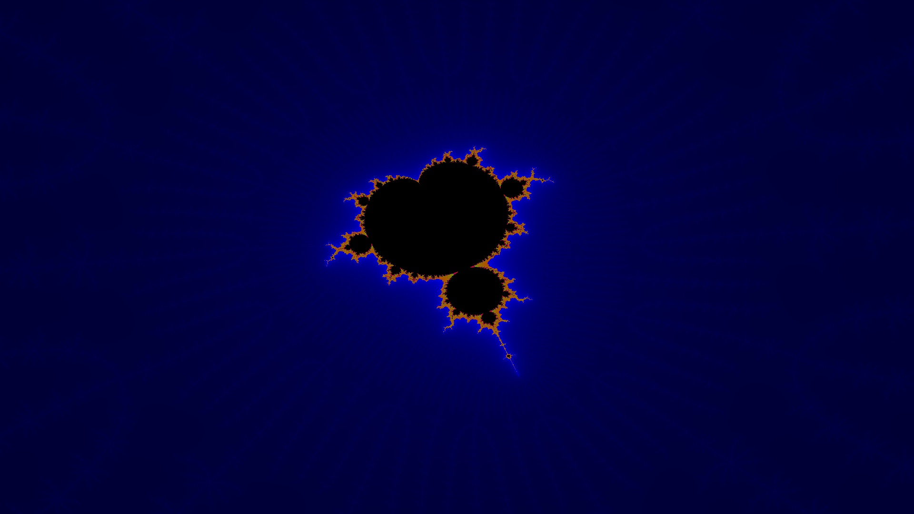
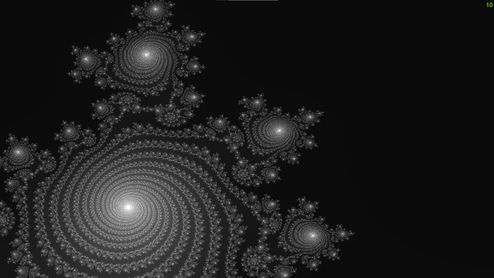
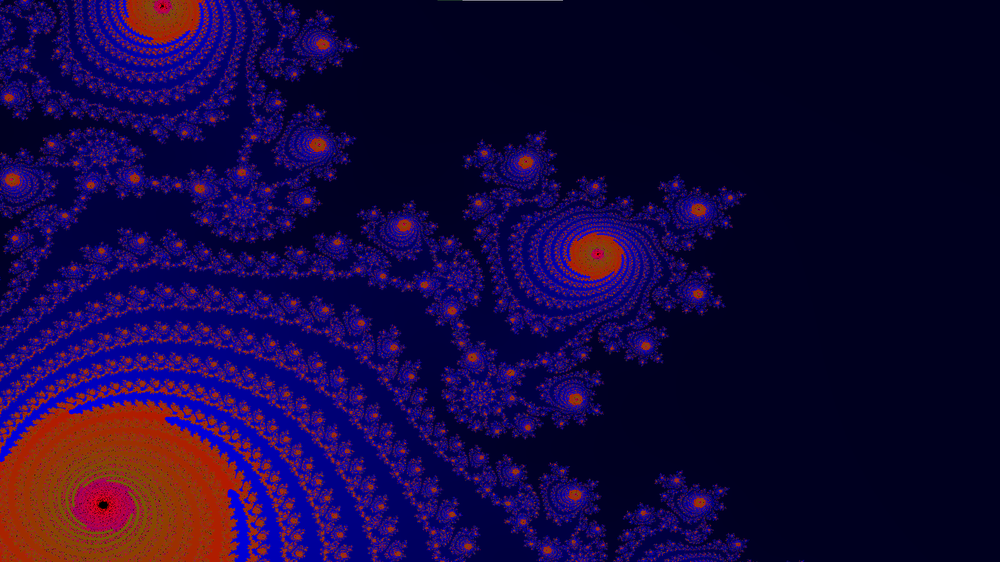

# Mandelbrot-Fractal

This project provides a multithreaded user interface to explore the wonders of the Mandelbrot-set fractal.

## Requirements
 - Java Runtime Enviroment **8** (A higher version also works)
 - A PC with a lot of CPU Cores/Threads
 - A display output
 - A keyboard and/or a mouse

## Controls
  Also supports **mouse** drag- and scroll events
 
 - <kbd>1</kbd> = **Toggles** the debug info
 - <kbd>2</kbd>, <kbd>3</kbd>, <kbd>4</kbd> = Switches threw some predefined colorpallets
 - <kbd>E</kbd> = Zooms **In**
 - <kbd>Q</kbd> = Zooms **Out**
 - <kbd>R</kbd> = **Higheres** the maxIterations (Higher Resolution)
 - <kbd>F</kbd> = **Lowers** the maxIterations (Lower Resolution)
 - <kbd>W</kbd> = Moves the camera **up**
 - <kbd>S</kbd> = Moves the camera **down**
 - <kbd>A</kbd> = Moves the camera to the **left**
 - <kbd>D</kbd> = Moves the camera to the **right**

# Preview Images

  
  
  

  
  
  

  
  
  

  
  
  

  
  
  

  
  

