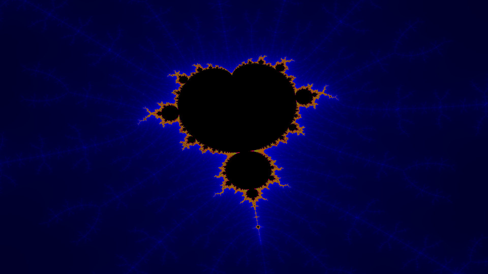

# Mandelbrot-Fractal

This project provides a user interface to explore the wonders of the Mandelbrot-set fractal.

## Requirements
 - Java Runtime Enviroment **8** (A higher version also works)
 - A PC with a lot of CPU Cores/Threads
 - A display output
 - A keyboard and/or a mouse

## Controls
  Also supports **mouse** drag- and scroll events
 
 - 1 Key = Toggles the debug info
 - 2 - 4 Key = Switches threw some predefined colorpallets
 - E Key = Zooms **In**
 - Q Key = Zooms **Out**
 - R Key = **Higheres** the maxIterations (Higher Resolution)
 - F Key = **Lowers** the maxIterations (Lower Resolution)
 - W Key = Moves the camera **up**
 - S Key = Moves the camera **down**
 - A Key = Moves the camera to the **left**
 - D Key = Moves the camera to the **right**

# Preview Images

  
  
  

  
  
  

  
  
  

  
  
  

  
  

